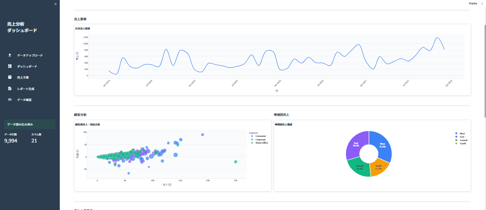
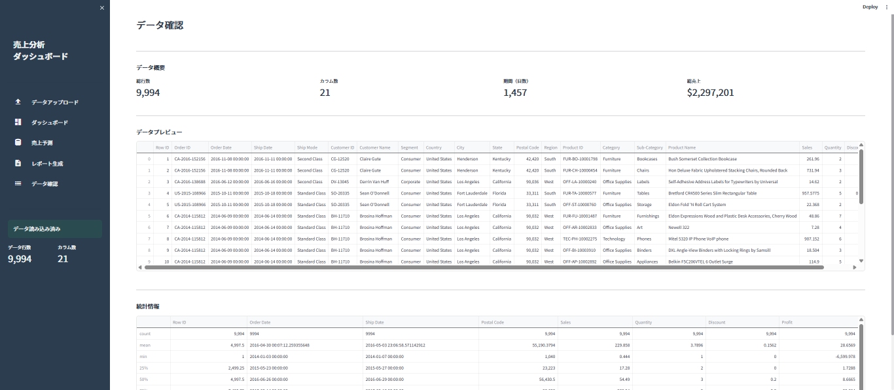
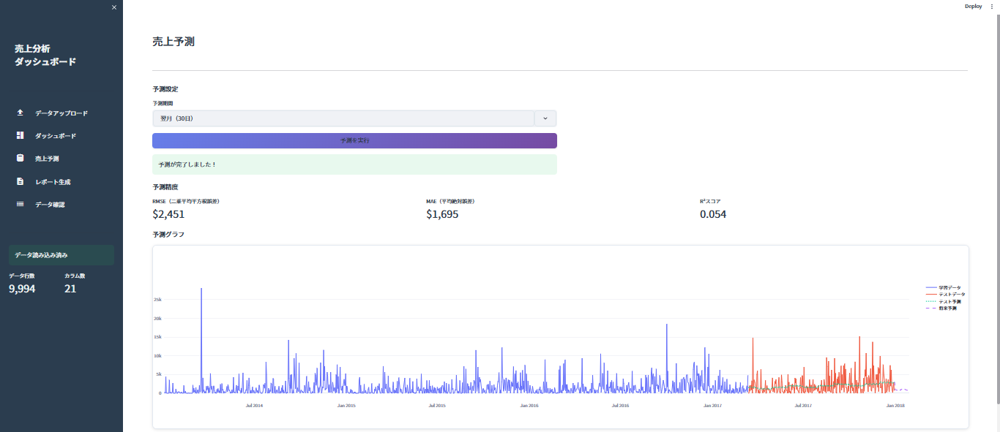
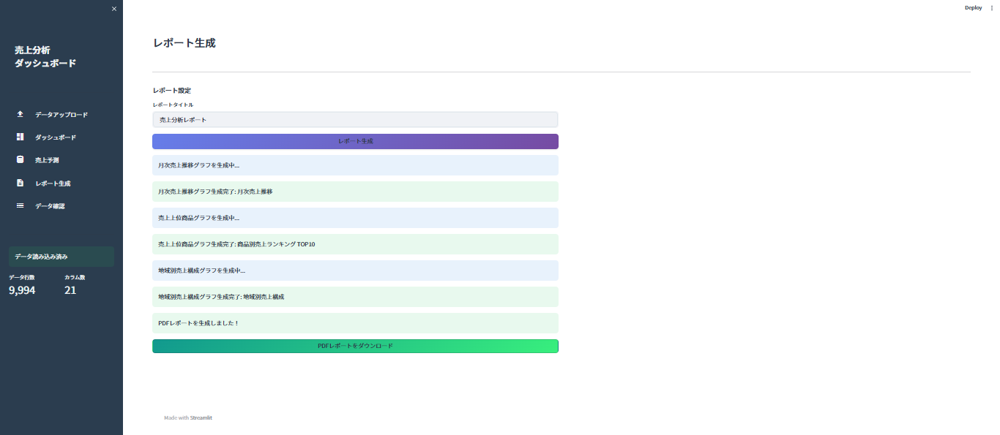
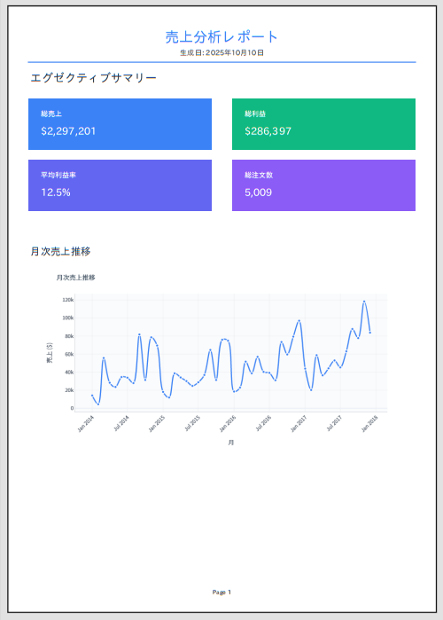

# 売上ダッシュボード＋分析レポート自動生成ツール

**Sales Dashboard & Report Automation Tool**

営業部門の売上レポート作成を完全自動化するStreamlitアプリケーション

手作業で行っている月次レポート作成を自動化し、インタラクティブなダッシュボードで売上を可視化、AI予測機能で将来の売上を予測し、モダンなPDFレポートを自動生成します。

---

## 📐 システム概要


*システム全体のアーキテクチャと処理フローを示す概要図*

### データフロー
```
CSV入力 → データ処理 → 可視化・分析 → レポート出力
   ↓         ↓           ↓           ↓
複数ファイル  統合       ダッシュボード   PDF
統合可能    クリーニング   7種グラフ     Excel
         検証        予測モデル
```

**処理ステップ:**
1. **データ入力**: CSVファイルアップロード（複数ファイル統合対応）
2. **データ処理**: エンコーディング自動検出、欠損値処理、型変換
3. **可視化・分析**: Plotlyによる7種類のインタラクティブグラフ生成
4. **売上予測**: scikit-learnの線形回帰モデルで将来予測
5. **レポート出力**: PDF自動生成、Excelダウンロード

---

## 📊 主な機能

- **CSVアップロード**: 複数ファイルの統合アップロード対応、自動エンコーディング検出（UTF-8/Shift-JIS/ISO-8859-1）
- **Excelダウンロード**: 統合されたデータをExcel形式でダウンロード可能
- **インタラクティブダッシュボード**: 7種類のPlotlyグラフで売上を可視化
  - 月次売上推移
  - 売上上位商品ランキング
  - 顧客分析（散布図）
  - 地域別売上構成
  - 前年同月比較
  - カテゴリ別構成
  - 利益率分析
- **売上予測**: 線形回帰による将来予測（30日/90日/180日/365日）
- **PDFレポート自動生成**: モダンなデザインのレポートをワンクリック生成
- **堅牢なエラーハンドリング**: データ検証、欠損値チェック、異常値検出

---

## 📸 アプリケーション画面

### メインダッシュボード

*売上推移、商品ランキング、顧客分析などを一覧表示*

### データ確認タブ

*アップロードしたCSVデータのプレビューと基本統計量*

### 売上予測タブ

*線形回帰モデルによる将来予測と精度評価指標*

### PDFレポート生成タブ

*グラフを選択してPDFレポートを自動生成*

### 生成されたPDFレポートサンプル

*モダンなデザインの自動生成レポート*

**画像配置方法:**
- スクリーンショットを `docs/images/` フォルダに保存
- ファイル名: `dashboard.png`, `data_view.png`, `prediction.png`, `pdf_generation.png`, `pdf_report_sample.png`, `system_overview.png`
- 推奨サイズ: 幅1200px以上（高解像度）

---

## 🚀 セットアップ

### 必要環境
- **Python**: 3.8以上（推奨: 3.9以降）
- **OS**: Windows、macOS、Linux
- **ブラウザ**: Chrome、Firefox、Edge（推奨: Chrome）

### インストール手順

#### 1. リポジトリのクローン
```bash
git clone <repository-url>
cd sales_dashboard
```

#### 2. 仮想環境の作成（推奨）
```bash
# Windows
python -m venv venv
venv\Scripts\activate

# macOS/Linux
python3 -m venv venv
source venv/bin/activate
```

#### 3. 依存パッケージのインストール
```bash
pip install -r requirements.txt
```

**主要パッケージ:**
- `streamlit==1.28.0` - Webアプリケーションフレームワーク
- `pandas==2.1.1` - データ処理
- `plotly==5.17.0` - インタラクティブグラフ
- `scikit-learn==1.3.1` - 機械学習（線形回帰）
- `fpdf2==2.7.6` - PDFレポート生成
- `openpyxl==3.1.2` - Excelファイル出力
- `kaleido==0.2.1` - Plotlyグラフの画像変換

#### 4. アプリケーション起動
```bash
streamlit run app.py
```

ブラウザが自動で開き、`http://localhost:8501` でアプリが起動します。

#### 5. サンプルデータで動作確認
サイドバーの「サンプルデータを使用」ボタンをクリックして、Superstore Dataset（9994行）を読み込みます。

## 📁 プロジェクト構造

```
sales_dashboard/
├── app.py                      # メインアプリケーション
├── requirements.txt            # 依存パッケージ
├── src/                        # ソースコード
│   ├── data_processor.py       # データ処理
│   ├── visualizer.py           # グラフ生成
│   ├── predictor.py            # 売上予測
│   └── pdf_generator.py        # PDFレポート生成
├── data/
│   ├── sample/                 # サンプルデータ
│   └── uploads/                # アップロードデータ
├── assets/                     # 静的ファイル（ロゴ、CSS）
└── outputs/reports/            # 生成されたPDFレポート
```

## 📊 使い方

### 1. データアップロード
- サイドバーからCSVファイルをアップロード（複数ファイル可）
- サンプルデータ（Superstore Dataset）も利用可能

### 2. ダッシュボード
- 売上推移、商品ランキング、顧客分析など7種類のグラフ
- フィルター機能で期間・カテゴリ・地域を絞り込み
- KPI（総売上、利益率、前月比）を表示

### 3. 売上予測
- 予測期間（30日/90日/180日/365日）を選択
- 線形回帰モデルで将来の売上を予測
- 精度評価指標（RMSE、MAE、R²）を表示

### 4. PDFレポート生成
- 含めるグラフを選択
- ワンクリックでモダンなPDFレポートを生成
- 自動所見コメント付き

## 📋 データフォーマット

CSVファイルは以下のカラムを含む必要があります：

| カラム名 | データ型 | 必須 |
|---------|---------|------|
| Order Date | date | ✓ |
| Sales | float | ✓ |
| Profit | float | ✓ |
| Product Name | string | ✓ |
| Customer Name | string | - |
| Region | string | - |
| Category | string | - |

サンプルデータ: `data/sample/Sample - Superstore.csv`

## 🛠️ 技術スタック

- **フレームワーク**: Streamlit 1.28.0
- **データ処理**: pandas 2.1.1、openpyxl 3.1.2
- **可視化**: Plotly 5.17.0
- **機械学習**: scikit-learn 1.3.1（線形回帰モデル）
- **PDF生成**: fpdf2 2.7.6（日本語対応）
- **画像処理**: Pillow 10.0.1、kaleido 0.2.1

---

## ❓ よくある質問（FAQ）

### Q1. サポートされているファイル形式は？
**A**: CSV形式のみサポートしています。Excel（.xlsx）ファイルは事前にCSVに変換してください。

### Q2. 複数のCSVファイルをアップロードした場合どうなりますか？
**A**: 自動的に統合され、1つのDataFrameとして処理されます。カラム名が一致している必要があります。

### Q3. 必須カラムは？
**A**: `Order Date`、`Sales`、`Profit`、`Product Name`の4つが必須です。これらが不足しているとエラーが表示されます。

### Q4. 日本語のCSVファイルが文字化けします
**A**: アプリは自動的にUTF-8、Shift-JIS、ISO-8859-1のエンコーディングを検出します。それでも文字化けする場合は、CSVファイルをUTF-8で保存し直してください。

### Q5. 予測精度が低いのですが？
**A**: 線形回帰モデルはシンプルなモデルです。以下を確認してください：
- データ量が十分か（最低100行必要、推奨は300行以上）
- データに季節性やトレンドがあるか（線形回帰は単純なトレンドのみ捉える）
- 外れ値が多くないか

### Q6. PDFレポートが生成できません
**A**: kaleidoパッケージがインストールされているか確認してください：
```bash
pip install kaleido==0.2.1
```

### Q7. グラフが表示されません
**A**: ブラウザのJavaScriptが有効になっているか確認してください。また、ブラウザのキャッシュをクリアしてみてください。

---

## 🔧 トラブルシューティング

### エラー: "予測に必要なデータが不足しています"
**原因**: データ行数が100行未満
**対処法**: より長期間のデータをアップロードしてください。

### エラー: "必須カラムが不足しています"
**原因**: CSVファイルに `Order Date`、`Sales`、`Profit`、`Product Name` のいずれかが欠けている
**対処法**: CSVファイルのヘッダー行を確認し、必須カラムを追加してください。

### エラー: "ファイルの読み込みに失敗しました"
**原因**: エンコーディングエラー、または破損したCSVファイル
**対処法**:
1. CSVファイルをUTF-8で保存し直す
2. Excelで開いて「名前を付けて保存」→「CSV UTF-8」を選択

### グラフ生成が遅い
**原因**: データ量が多い（10万行以上）
**対処法**:
- 日付範囲フィルターで絞り込む（今後実装予定）
- データを月次集計してから使用する

### PDFレポートにグラフが表示されない
**原因**: kaleidoのインストール不足、またはメモリ不足
**対処法**:
```bash
pip uninstall kaleido
pip install kaleido==0.2.1
```

### ディスク容量不足エラー
**原因**: 一時ファイル生成時にディスク容量が不足
**対処法**: 不要なファイルを削除してディスク容量を確保してください。

---

## 📚 ドキュメント

- [ユーザーガイド](docs/user_guide.md) - 各機能の詳細説明
- [開発者ガイド](docs/developer_guide.md) - アーキテクチャとAPI仕様
- [テスト結果](docs/test_results.md) - 動作確認結果
- [CLAUDE.md](CLAUDE.md) - プロジェクト全体の設計書

---

## 📄 ライセンス

MIT License

Copyright (c) 2025 Sales Dashboard Project

Permission is hereby granted, free of charge, to any person obtaining a copy
of this software and associated documentation files (the "Software"), to deal
in the Software without restriction, including without limitation the rights
to use, copy, modify, merge, publish, distribute, sublicense, and/or sell
copies of the Software, and to permit persons to whom the Software is
furnished to do so, subject to the following conditions:

The above copyright notice and this permission notice shall be included in all
copies or substantial portions of the Software.

THE SOFTWARE IS PROVIDED "AS IS", WITHOUT WARRANTY OF ANY KIND, EXPRESS OR
IMPLIED, INCLUDING BUT NOT LIMITED TO THE WARRANTIES OF MERCHANTABILITY,
FITNESS FOR A PARTICULAR PURPOSE AND NONINFRINGEMENT. IN NO EVENT SHALL THE
AUTHORS OR COPYRIGHT HOLDERS BE LIABLE FOR ANY CLAIM, DAMAGES OR OTHER
LIABILITY, WHETHER IN AN ACTION OF CONTRACT, TORT OR OTHERWISE, ARISING FROM,
OUT OF OR IN CONNECTION WITH THE SOFTWARE OR THE USE OR OTHER DEALINGS IN THE
SOFTWARE.

---

## 🤝 貢献

プルリクエストを歓迎します！大きな変更の場合は、まずissueを開いて変更内容を議論してください。

---

## 📧 お問い合わせ

バグ報告や機能リクエストは [Issues](https://github.com/your-repo/sales_dashboard/issues) にお願いします。
